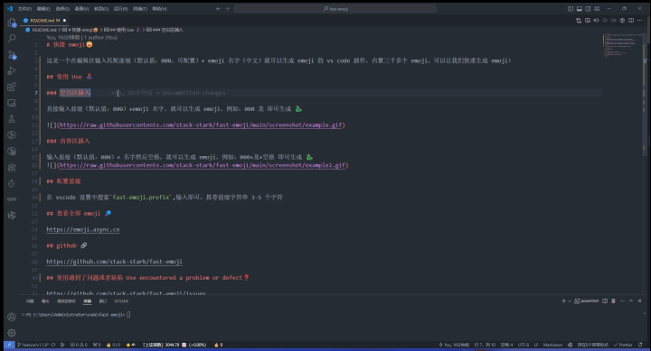
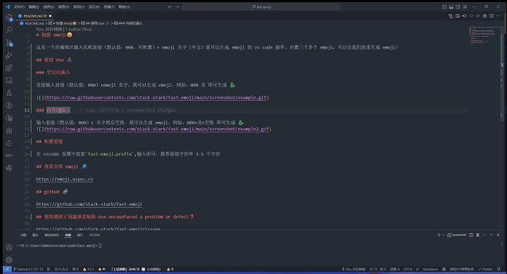
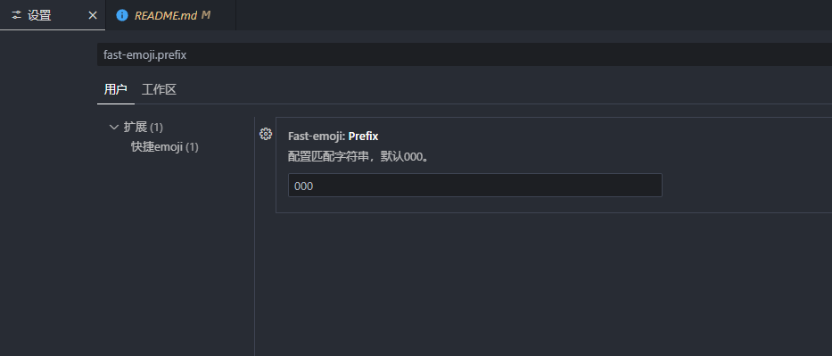

# 快捷 emoji😀

这是一个在编辑区输入匹配前缀（默认值：000，可配置）+ emoji 名字（中文）就可以生成 emoji 的 vs code 插件，内置三千多个 emoji，可以让我们快速生成 emoji！

## 使用 Use 🕹️

### 空白区插入

直接输入前缀（默认值：000）+emoji 名字，就可以生成 emoji，例如：000 龙 即可生成 🐉

### 内容区插入

输入前缀（默认值：000）+ 名字然后空格，就可以生成 emoji，例如：000+龙+空格 即可生成 🐉

## 配置前缀

在 vscode 设置中搜索`fast-emoji.prefix`,输入即可，推荐前缀字符串 3-5 个字符

## 插件安装 🚀

https://marketplace.visualstudio.com/items?itemName=stack-stark-code.fast-emoji

## 查看全部 emoji 🔎

https://emoji.async.cn

## github 🔗

https://github.com/stack-stark/fast-emoji

## 使用遇到了问题或者缺陷 Use encountered a problem or defect❓

https://github.com/stack-stark/fast-emoji/issues

## License 📖

MIT
